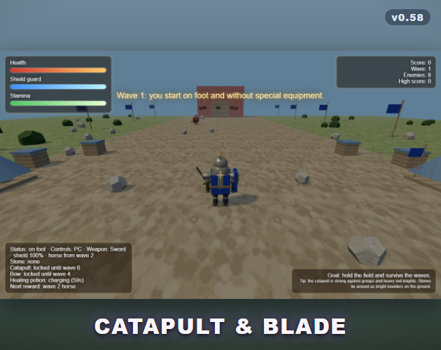
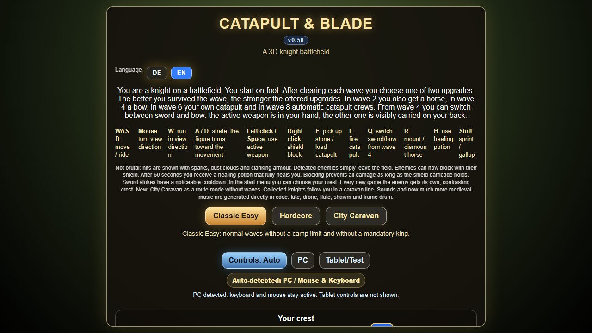
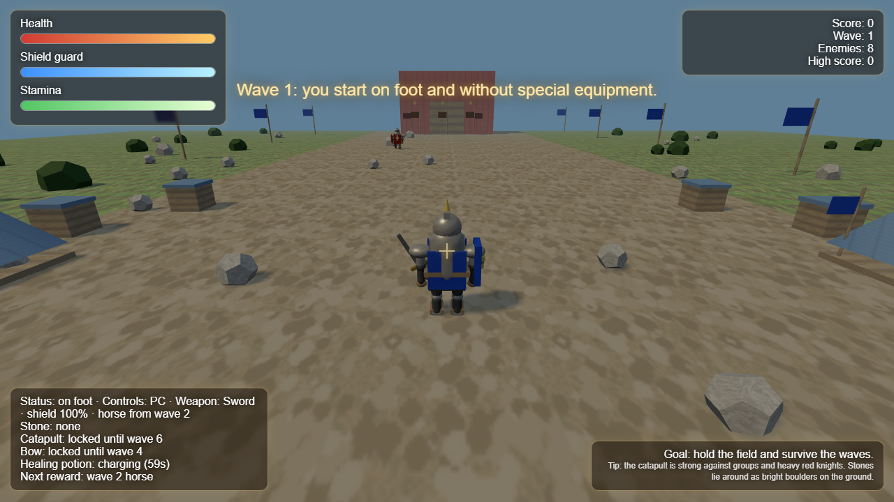

# Catapult & Blade ⚔️

> *Deutsch unten — [Zur deutschen Version](#-katapult--klinge-deutsch)*

A 3D medieval browser game built with [Three.js](https://threejs.org/). You are a
knight on the battlefield: survive the waves, choose upgrades, ride a horse, fire a
catapult and recruit a caravan of allied knights.

**This game was created entirely by Justus Dütscher (10 years old) — all by himself.** 🎉
This repository turns his prototype into a clean, structured, multilingual project,
without changing the game he made.

<p align="center">
  <a href="https://jumavegames.itch.io/catapult-and-blade">
    
  </a>
</p>

<p align="center"><b>▶ Play it in your browser on <a href="https://jumavegames.itch.io/catapult-and-blade">itch.io</a></b></p>

---

## ✨ Features

- **Three game modes:** Classic Easy, Hardcore (enemy king only) and City Caravan
  (escort run without waves).
- **Wave progression with upgrades:** the better you clear a wave, the stronger the
  two upgrades you get to choose from.
- **Unlockables:** horse (wave 2), bow (wave 4), your own catapult (wave 6) and
  automatic catapult crews (wave 8).
- **Heraldry:** pick your own crest; every enemy army gets a contrasting one.
- **Procedural audio:** all music and sound effects are generated in code
  (lute, drone, flute, shawm, frame drum).
- **Multilingual:** German 🇩🇪 and English 🇬🇧, auto-detected from the browser with an
  in-game language switch.
- **PC and tablet/touch controls**, auto-detected.
- **Runs fully in the browser** — only [Three.js](https://threejs.org/) is loaded from a CDN.

## 🎮 Controls (PC)

| Key | Action |
| --- | --- |
| `W` `A` `S` `D` | Move / ride |
| Mouse | Look around |
| Left click / `Space` | Use active weapon |
| Right click | Raise shield |
| `E` | Pick up stone / load catapult |
| `F` | Fire catapult |
| `Q` | Switch sword/bow (from wave 4) |
| `R` | Mount / dismount horse |
| `H` | Drink healing potion |
| `Shift` | Sprint / gallop |

On tablets, on-screen joystick and buttons are shown automatically.

## 🚀 Run it locally

The game uses ES modules and loads Three.js from a CDN, so it must be served over
HTTP (opening `index.html` via `file://` will not work).

**Option A — Node (recommended):**

```bash
npm start
```

This serves the folder on a local port (printed in the terminal). Open the shown URL.

**Option B — Python:**

```bash
python -m http.server 8000
```

Then open <http://localhost:8000>.

**Option C — VS Code:** use the *Live Server* extension and "Go Live".

> Three.js is bundled locally (`src/vendor/three.module.js`), so **no internet is
> needed** — the game runs fully offline. You only need to serve it over HTTP (not
> `file://`), because browsers block ES modules loaded from the filesystem.

## 🖼️ Screenshots

| Menu | In-game |
| --- | --- |
|  |  |

Regenerate them (German + English, menu + in-game) with:

```bash
npm run shots      # -> screenshots/{menu,game}-{de,en}.png
```

## 📦 Publish on itch.io

The game is plain static files, so it works as an itch.io **HTML5** game (no server
of your own, Node is only a local dev convenience). Build the upload zip with:

```bash
npm run build      # -> dist/catapult-blade-v<version>-itch.zip
```

On itch.io: create a new project, *Kind of project* = **HTML**, upload the zip, tick
**"This file will be played in the browser"**, and set a viewport (e.g. 1280×720)
with fullscreen enabled. `index.html` is at the zip root, as itch expects.

### Automated uploads with butler (optional)

itch.io's CLI [butler](https://itchio.itch.io/butler) can push builds straight to
your project — **including while it is still a draft / unpublished** (the page just
has to exist once). Builds upload to a channel; you publish the page later.

```bash
# one-time: create the game page on itch.io (may stay a draft),
# install butler, and get an API key at https://itch.io/user/settings/api-keys
export BUTLER_API_KEY=xxxxx          # PowerShell: $env:BUTLER_API_KEY = "xxxxx"
npm run publish -- yourname/catapult-blade
```

This stages the bundle and runs `butler push dist/itch yourname/catapult-blade:html5
--userversion <package.json version>`. The API key is only read from the environment —
never hardcode it or paste it anywhere.

## 🛠️ npm scripts

| Command | What it does |
| --- | --- |
| `npm start` | Serve the game locally on <http://localhost:8000> |
| `npm run build` | Build the itch.io upload zip into `dist/` |
| `npm run shots` | Generate DE/EN menu + in-game screenshots |
| `npm test` | Run the i18n runtime test |

## 📁 Project structure

```
Catapult-Blade/
├── index.html               # Entry point (HTML shell + screens, data-i18n markup)
├── src/
│   ├── css/styles.css       # All styling
│   ├── i18n/                # index.js (t/applyTranslations), de.js, en.js
│   ├── data/textures.js     # Embedded base64 textures
│   ├── three.js             # Re-export of the locally bundled Three.js
│   ├── vendor/              # Bundled Three.js (no CDN needed)
│   ├── config.js            # Constants, palettes, spawn points
│   ├── version.js           # Single source of the version string
│   ├── splash.js            # Intro splash screen
│   └── game/main.js         # Game engine
├── prototype/               # The original single-file prototype (archive)
├── tools/                   # Dev server, itch build, screenshots, migration, tests
├── CHANGELOG.md
├── README.md
├── AGENTS.md                # Notes for AI/code agents
└── LICENSE                  # MIT
```

## 🌍 Languages

The language is auto-detected from the browser (`navigator.language`) and can be
switched at any time with the language buttons in the menu. To add a language, copy
`src/i18n/en.js`, translate the values, and register it in `src/i18n/index.js`.

## 📜 License

[MIT](LICENSE) — © 2026 Justus Dütscher.

---

# 🇩🇪 Katapult & Klinge (Deutsch)

Ein 3D-Mittelalter-Browserspiel mit [Three.js](https://threejs.org/). Du bist ein
Ritter auf dem Schlachtfeld: Überstehe die Wellen, wähle Upgrades, reite ein Pferd,
feuere ein Katapult ab und sammle eine Karawane verbündeter Ritter ein.

**Dieses Spiel wurde komplett von Justus Dütscher (10 Jahre) ganz alleine erstellt.** 🎉
Dieses Repository macht aus seinem Prototyp ein sauberes, strukturiertes und
mehrsprachiges Projekt — ohne das Spiel selbst zu verändern.

## ✨ Funktionen

- **Drei Spielmodi:** Classic Easy, Hardcore (nur feindlicher König) und Stadtkarawane
  (Begleit-Modus ohne Wellen).
- **Wellen mit Upgrades:** Je besser du eine Welle überstehst, desto stärker sind die
  zwei angebotenen Verbesserungen.
- **Freischaltungen:** Pferd (Welle 2), Bogen (Welle 4), eigenes Katapult (Welle 6)
  und automatische Katapult-Truppen (Welle 8).
- **Wappen:** Wähle dein eigenes Wappen; jeder Gegner bekommt ein kontrastierendes.
- **Prozedurale Musik & Sounds:** komplett im Code erzeugt (Laute, Bordun, Flöte,
  Schalmei, Rahmentrommel).
- **Mehrsprachig:** Deutsch 🇩🇪 und Englisch 🇬🇧, automatisch erkannt, im Spiel umschaltbar.
- **PC- und Tablet/Touch-Steuerung**, automatisch erkannt.
- **Läuft komplett im Browser** — nur Three.js wird per CDN geladen.

## 🎮 Steuerung (PC)

| Taste | Aktion |
| --- | --- |
| `W` `A` `S` `D` | Laufen / reiten |
| Maus | Blickrichtung drehen |
| Linksklick / `Leertaste` | Aktive Waffe benutzen |
| Rechtsklick | Schild halten |
| `E` | Stein aufnehmen / Katapult laden |
| `F` | Katapult abfeuern |
| `Q` | Schwert/Bogen wechseln (ab Welle 4) |
| `R` | Pferd besteigen / absteigen |
| `H` | Heiltrank benutzen |
| `Shift` | Sprint / Galopp |

Auf Tablets erscheinen Joystick und Buttons automatisch.

## 🚀 Lokal starten

Das Spiel nutzt ES-Module und lädt Three.js per CDN — es muss daher über HTTP
ausgeliefert werden (ein Öffnen per `file://` funktioniert nicht).

**Variante A — Node (empfohlen):**

```bash
npm start
```

**Variante B — Python:**

```bash
python -m http.server 8000
```

Dann <http://localhost:8000> öffnen.

**Variante C — VS Code:** *Live Server*-Erweiterung und „Go Live".

> Three.js ist lokal enthalten (`src/vendor/three.module.js`) — **kein Internet nötig**,
> das Spiel läuft komplett offline. Es muss nur über HTTP ausgeliefert werden (nicht
> `file://`), da Browser ES-Module vom Dateisystem blockieren.

> **itch.io:** Mit `npm run build` entsteht `dist/catapult-blade-v<version>-itch.zip` — als
> HTML5-Spiel hochladen (Node ist nur lokaler Komfort, itch braucht keinen Server).

## 📜 Lizenz

[MIT](LICENSE) — © 2026 Justus Dütscher.
